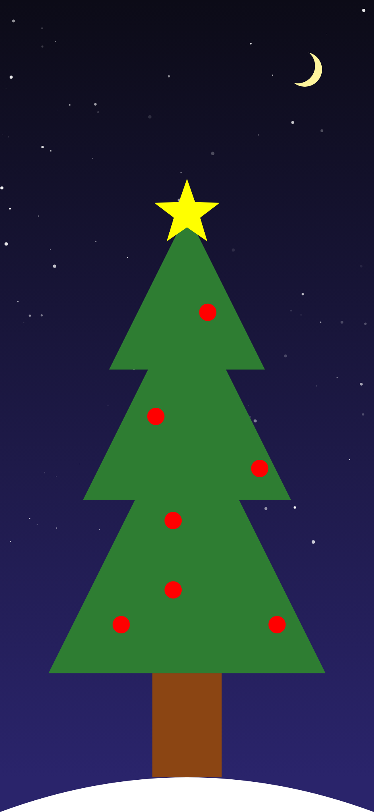

# 🎄 Compose Christmas Challenge 2025

**Welcome to the #ComposeChristmas Advent Calendar!**

Hosted by **[AndroidDev_News](https://androiddev.news)**, this challenge is designed to help you level up your Jetpack Compose skills—specifically focusing on `Canvas`, `Custom Graphics`, and `Animations`—in a fun, festive way.

## 🎅 The Goal
By December 24th, you will have built a fully animated, interactive Christmas scene from scratch, one composable at a time.

## 🚀 How to Participate

1.  **Fork or Clone** this repository to get the starter project (or start a fresh "Empty Compose Activity").
2.  **Check the Calendar** below for the daily task.
3.  **Code** your solution using Jetpack Compose.
4.  **Share** your progress on X (Twitter):
    * Post a screenshot or video of your result.
    * Tag **@AndroidDev_News**.
    * Use the hashtag **#ComposeChristmas**.

---

## 📅 The Advent Calendar

Complete one task per day to build your scene layer by layer.

| Day | Task Title | Detailed Instructions |
| :--- | :--- | :--- |
| **1** | **The Foundation** | Initialize your project and draw the basic green triangle for the body of the tree using `Canvas` and `Path`. Add a sturdy brown trunk to the bottom of your tree. Ensure it centers correctly relative to the foliage. Keep it simple; just the silhouette for now.|
| **2** | **Layered Branches** | Refine the tree shape. Instead of one big triangle, draw 3–4 tiered triangles (or jagged layers) to give it a realistic pine tree look. |
| **3** | **Winter Sky** | Create a background. Use a `Brush.verticalGradient` to create a "Night Sky" or "Winter Morning" backdrop behind the tree. Don't forget to add a few bright stars. |
| **4** | **Snowy Ground** | Draw a curved, snowy hill at the bottom of the screen using a quadratic or cubic `Path` so the tree isn't floating in the void. |
| **5** | **The Star Topper** | Draw a 5-pointed Star at the very top of the tree. Bonus points for using a `RadialGradient` to make it look shiny. |
| **6** | **Baubles (Basic)** | Draw circular ornaments scattered on the tree branches. Use a hardcoded list of `Offset` coordinates or randomize their positions within the tree bounds. |
| **7** | **Moon** | Draw the moon, any phase. Consider adding craters. |
| **8** | **Baubles (Fancy)** | Upgrade the baubles. Add colors, a small "shine" reflection (a smaller white circle) or a hook to make them look 3D using gradients. |
| **9** | **The Garland** | Draw a tinsel garland wrapping around the tree. This requires using `Path` with bezier curves to simulate the garland draping over the branches. Use `PathMeasure` to add a style along your Garland |
| **10** | **Candy Canes** | Create a custom Composable or draw a shape that looks like a Candy Cane (red and white stripes) and hang at least two on the tree. |
| **11** | **Fairy Lights (Wire)** | Draw the wire for the lights wrapping around the tree (similar to the garland, but thinner). |
| **12** | **Fairy Lights (Bulbs)** | Add small colored circles along the wire you drew yesterday. Create a `data class` for LightState to prepare for future animation. |
| **13** | **Presents (Boxes+Ribbons)** | Draw 2–3 square or rectangular gift boxes sitting under the tree on the snowy ground. Give them different colors. Draw ribbons and bows on top of the gift boxes using `Canvas` lines or rectangles. |
| **14** | **Animate the sky** | Animate the sky by making the star more or less shiny/opaque, you can also simulate the sunset/sunrise by animating the color of the background gradient. |
| **15** | **Snowflakes (Design)** | Design a single Snowflake Composable. You can use simple lines crossing at a center point or a complex SVG path. Consider making it a function with multiple parameters to control the snowflake shape |
| **16** | **Snowfall (Static)** | Draw multiple snowflakes at random positions and sizes in the sky area (the background). |
| **17** | **Shadows & Depth** | Add a drop shadow below the tree and the gifts on the snow to ground them. Use `Paint` with blur or semi-transparent black ovals. Build the shadow with the tree and gift object |
| **18** | **Text Banner** | Add a "Merry Christmas" or "Happy Holidays" greeting at the top or bottom using `drawText` (native Canvas text) or a text overlay. |
| **19** | **Animation: Twinkle** | Time to animate! Use `infiniteTransition` to make the Fairy Lights (Day 12) toggle between on/off or change alpha to "twinkle.". You be creative and make the color of the light change. |
| **20** | **Animation: The Star** | Add a scaling or glowing animation to the Star Topper (Day 6) so it pulses gently. |
| **21** | **Animation: Snowfall** | Animate the Y-offset and X-offset of the snowflakes (Day 16) so they fall from top to bottom continuously, in a soft motion |
| **22** | **Interaction: Light Switch** | Add a `Modifier.clickable` (or `detectTapGestures`) to the tree. Tapping it should change the color pattern of the lights or toggle them off. |
| **23** | **Polishing: Gradient Tree** | Revisit the tree branches (Day 3). Apply a `Brush.linearGradient` (Dark Green to Light Green) to give the tree volume and lighting. |
| **24** | **The Grand Reveal** | Put it all together! Add a final touch (maybe a Snowman, a deer?) and record a video of the full scene with animations active. Share your repository! |

---

## 📚 Helpful Resources

If you get stuck, check out these official Android documentation pages:

* [Graphics in Compose](https://developer.android.com/jetpack/compose/graphics)
* [Canvas API](https://developer.android.com/jetpack/compose/graphics/draw/modifiers)
* [Animations in Compose](https://developer.android.com/jetpack/compose/animation)

If you use Kotlin Multiplatform:
* [Kotlin Multiplatform plugin](https://plugins.jetbrains.com/plugin/14936-kotlin-multiplatform)
* [Compose Multiplatform](https://github.com/JetBrains/compose-multiplatform)
* [Compose Hot Reload](https://github.com/JetBrains/compose-hot-reload)

---

**Happy Coding! 🎄**

